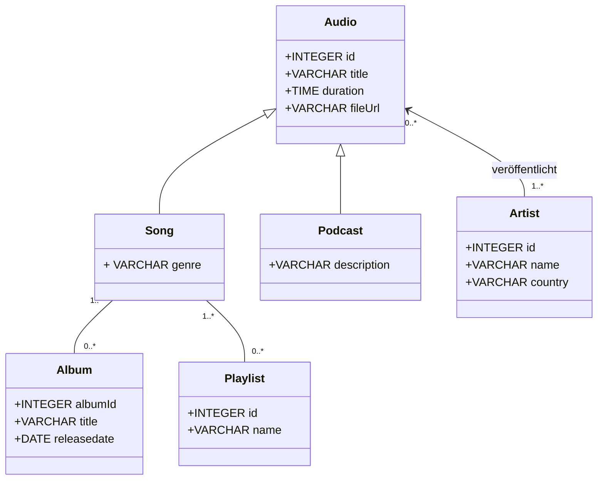

# Audioverwaltung

## Beschreibung

Die Audioverwaltung verwaltet Musikkatalog und Benutzerbewertungen. Ein Artist ist entweder ein Solokünstler oder eine Band. Jeder Artist veröffentlicht beliebig viele Alben, jedes Album gehört genau einem Artist. Ein Album enthält mindestens einen Song und hat ein Veröffentlichungsdatum. Jeder Song hat eine Dauer und eine Track-Nummer innerhalb seines Albums. Songs werden einem oder mehreren Stilen zugeordnet (z.B. Rock, Jazz), ein Stil umfasst viele Songs. Benutzer bewerten Songs mit einer Punktzahl und einem Zeitstempel.

## Konsistenzbedingungen

1. Die Punktzahl einer Bewertung liegt zwischen 1 und 5.
2. Ein Benutzer kann denselben Song nur einmal bewerten.
3. Die Track-Nummer ist innerhalb eines Albums eindeutig.
4. Das Gründungsjahr einer Band liegt nicht in der Zukunft.
5. Das Bewertungsdatum liegt nicht vor dem Veröffentlichungsdatum des Albums des bewerteten Songs.

## Klassendiagramm

    note for Artist "Vererbung: disjoint, complete (Solokünstler oder Band)"
    note for Bewertung "K1: punkte zwischen 1 und 5 K2: pro Benutzer und Song nur eine Bewertung K5: bewertetAm nicht vor Album.veroeffentlichungsdatum"
    note for Song "K3: trackNummer pro Album eindeutig"
    note for Band "K4: gruendungsjahr nicht in der Zukunft"
