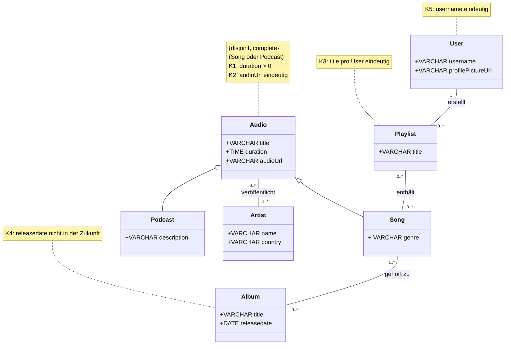

# Audioverwaltung

## Beschreibung

Die Audioverwaltung verwaltet Audioinhalte wie Songs und Podcasts. Jedes Audio hat einen Titel, eine Dauer und eine Audio-URL und ist entweder ein Song oder ein Podcast. Ein Song hat zusätzlich ein Genre, ein Podcast eine Beschreibung. Audios werden von einem oder mehreren Artists veröffentlicht, ein Artist veröffentlicht beliebig viele Audios. Songs können auf Alben erscheinen, ein Album hat ein Veröffentlichungsdatum und enthält mindestens einen Song. Ein Song kann auf mehreren Alben vorkommen oder auf keinem (Single). User haben einen Benutzernamen und ein Profilbild und erstellen eine oder mehrere Playlists, die Songs enthalten. Ein Song kann in beliebig vielen Playlists enthalten sein.

## Konsistenzbedingungen

1. Die Dauer eines Audios ist grösser als 0.
2. Die Audio-URL eines Audios ist eindeutig.
3. Der Titel einer Playlist ist pro User eindeutig.
4. Das Veröffentlichungsdatum eines Albums liegt nicht in der Zukunft.
5. Der Benutzername eines Users ist eindeutig.

## Einsatz von KI

Beschreibung, Konsistenzbedingungen und Klassendiagramm wurde von den Autoren erstellt mit Unterstützung von Claude Code verbessert.

## Klassendiagramm

